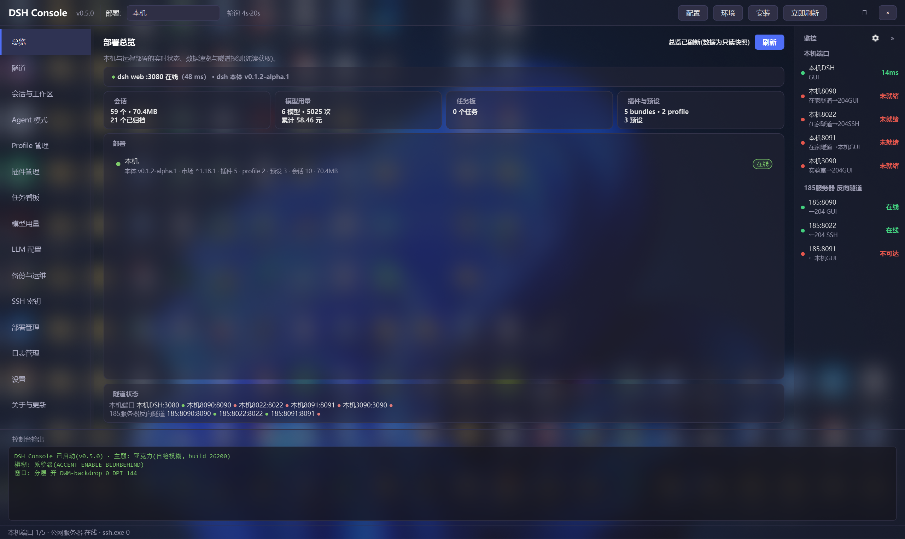
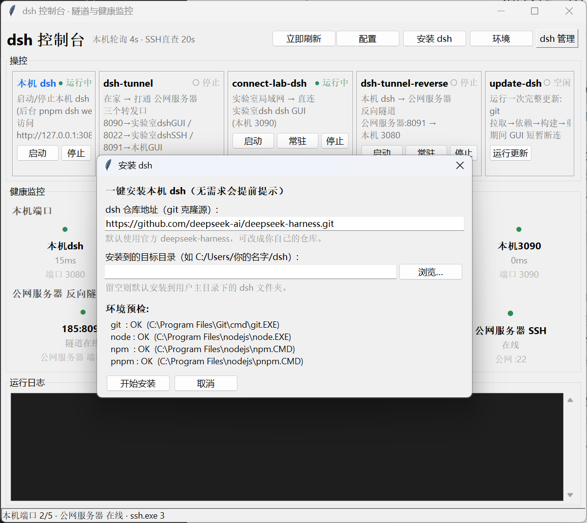
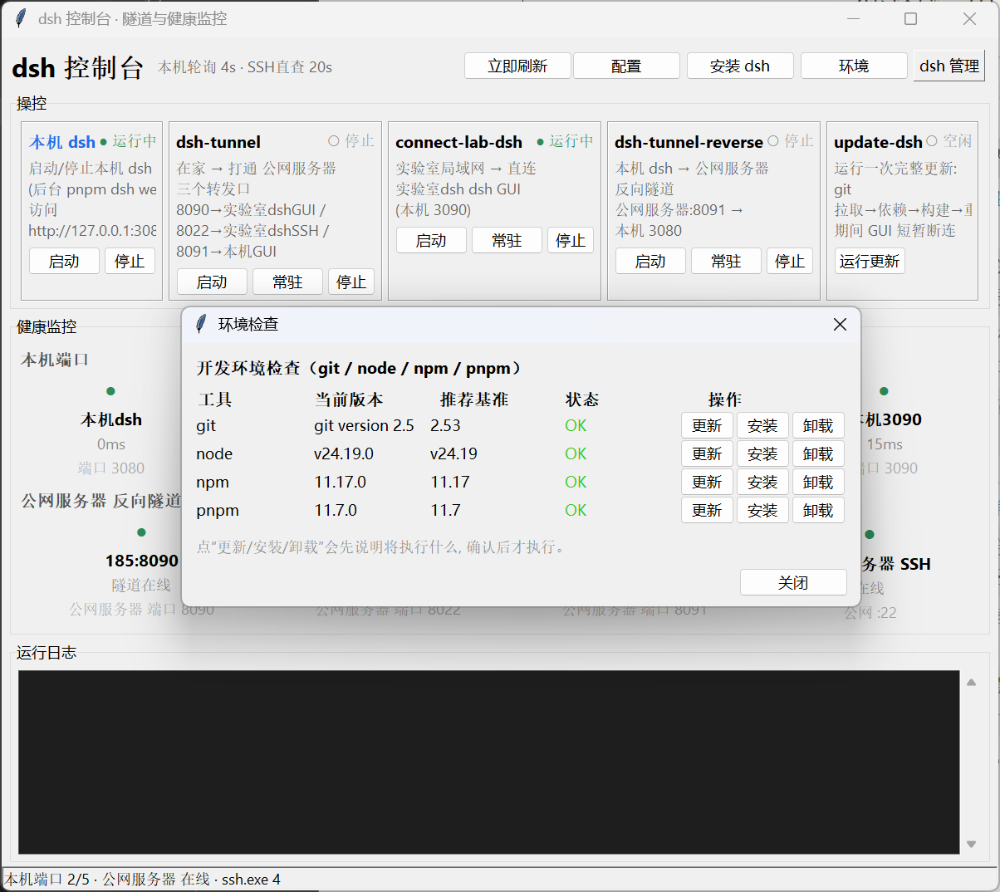
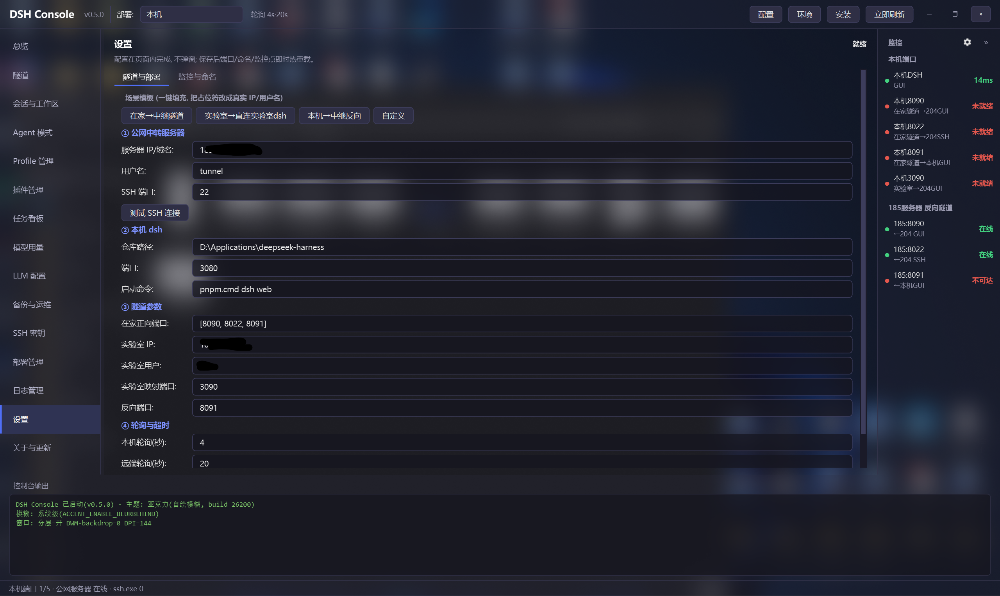
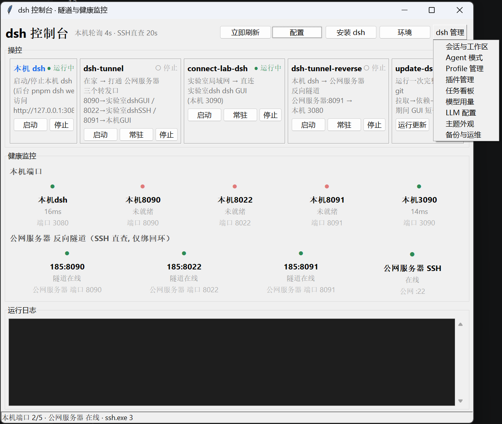
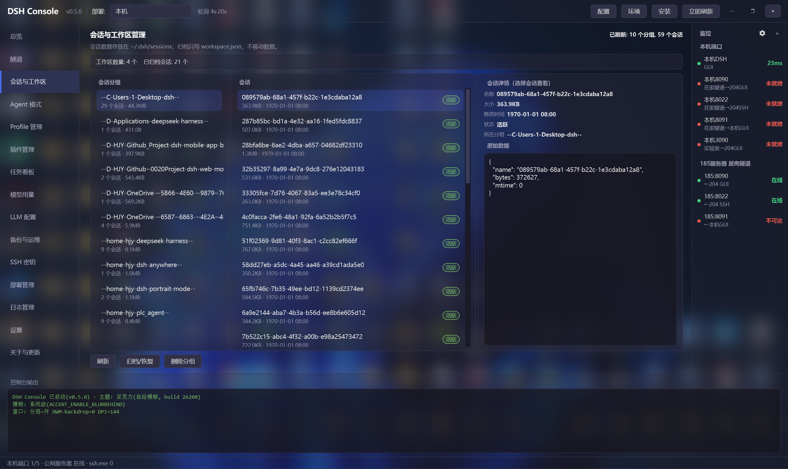
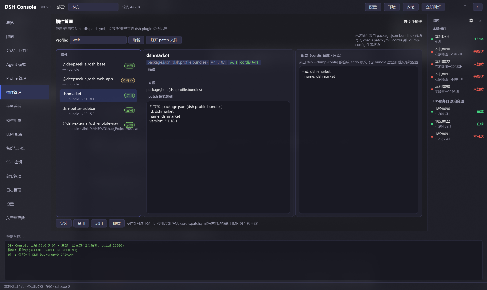
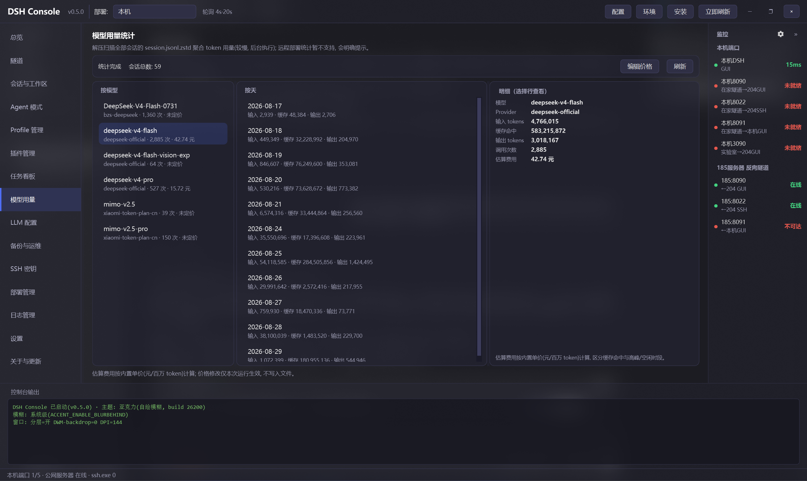
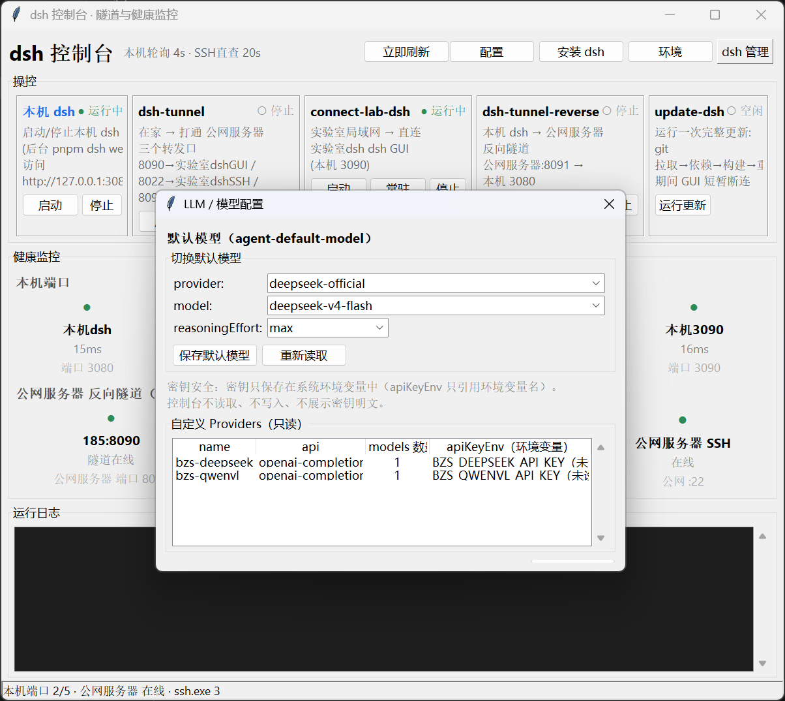

# dsh-console-aio

> 中文 | [English](#english)

**SSH 隧道可视化管理器 + 服务健康监控**（Windows GUI）。把平时要敲命令行的 SSH 隧道启动/停止/常驻，和一整套服务的健康监控，打包成一个零依赖的图形界面。

- 🚀 一键操作：本机 dsh 启停、三条 SSH 隧道（启动/常驻/停止）、dsh 一键更新、全新环境一键安装 dsh
- 🖥️ 环境检查：独立窗口查看 git/node/npm/pnpm 版本与推荐基准，更新/卸载引导；安装目录支持系统文件夹选择
- 📡 健康监控：本机端口 + SSH 直查远端反向隧道，两层监控一屏可见
- ⚙️ 配置外置：IP / 用户名 / 仓库路径 / 端口 / 轮询间隔全部集中在 config.json
- 🧩 零依赖：仅用 Python 标准库（tkinter），无需 pip 安装任何东西

---

## 快速开始

### 方式一：安装包（推荐）
下载 **dsh-console-aio-setup-0.3.0.exe**（GitHub Releases 或 dist/ 目录），双击安装即可使用（无需 Python 环境）。
安装后可创建桌面快捷方式；卸载走系统控制面板。

### 方式二：双击（源码）
双击 **启动dsh控制台.bat** —— 它优先使用 conda base 的 pythonw 启动，找不到再回退 PATH。

### 方式三：命令行
    python dsh-console-aio.py

> 💡 需要本机安装 Python 3（建议 Miniconda base，路径可改 启动dsh控制台.bat 顶部的 PYW）。

---

## 界面布局（示意）

    顶部:  [ dsh 控制台 v0.4 ]   部署:[本机 ▾]   轮询 4s·20s   [环境][安装 dsh][配置][dsh 管理▾][立即刷新]

    左导航  │ 中栏: 控制项页面(点击切换)      │ 右状态栏
    总览     │ 总览: 隧道操控卡片               │ 本机端口 ●●●●●
    会话     │ 会话与工作区管理...              │ 公网服务器 反向隧道 ●●●
    插件     │ (部署切换时页面数据跟着切换)     │ 公网服务器 SSH
    用量     │                                │
    LLM     │                                │
    ...     │                                │
    ────────┼────────────────────────────────┼──────────
    底部: 控制台输出(日志实时滚动) / 状态栏

  * ●=绿:健康/运行   ●=红:异常/未就绪   * 切换顶部部署选择器 = 切换管理目标

---

## 一键安装 dsh（全新环境）

顶部点 **【安装 dsh】** 打开安装向导：填 dsh 的 git 仓库地址（默认官方 deepseek-harness）与目标目录，工具会自动：

1. **环境预检**：检查 git / node / npm / pnpm 是否可用，缺失会明确提示先装什么
2. **git clone**：拉取 dsh 源码到目标目录
3. **pnpm install**：安装依赖
4. **pnpm run build**：构建
5. 完成后**自动把目标目录写进 config.json 的 dash_repo**（重启后生效）

适合在没有 dsh 的新机器 / 新用户上，从零一键搭好本机 dsh。

顶部 **【环境】** 打开环境检查窗口，可查看/更新/安装/卸载 git、node、npm、pnpm：

---

## 配置（config.json）

所有可调项都在同目录的 config.json，也可点界面右上角 【配置】 打开隧道配置向导（保存后重启生效）。

向导把参数分成 4 组，并提供内置场景模板一键填充端口映射：
- ① 公网中转服务器：IP / 用户名，可点 测试 SSH 连接 在线验证免密能否连通
- ② 本机 dsh：仓库路径 / 端口 / 启动命令
- ③ 隧道参数：在家正向端口(forward_ports)、实验室直连(lab_server / lab_user / lab_port)、本机反向(reverse_port)——这些原来只能手改 JSON，现在都能在界面里编辑
- ④ 轮询：本机 / 远端健康检查间隔

首次使用可直接在向导里点一个场景模板(如 在家→中继隧道)，把占位符 YOUR_* 改成真实 IP/用户名即可，无需手动编辑 JSON。

仓库自带一份 config.example.json（不含真实 IP 的模板）。首次使用请：

    copy config.example.json config.json   # 然后编辑其中的 IP/仓库路径/端口

若没有 config.json，程序会使用内置默认值正常运行。

| 字段 | 说明 | 默认 |
|------|------|------|
| ssh_server | 公网中转服务器 IP/域名 | YOUR_PUBLIC_IP |
| ssh_user | 中转服务器隧道用户名 | YOUR_USER |
| dash_repo | 本机 dsh 仓库路径 | <留空, 在向导里填> |
| dash_port | 本机 dsh GUI 端口 | 3080 |
| dash_cmd | 本机 dsh 启动命令 | ["pnpm.cmd","dsh","web"] |
| local_ports | 本机端口监控 [端口,名称,说明] | 3080/8090/8022/8091/3090 |
| remote_tunnels | 远端反向隧道监控 [端口,名称,说明] | 8090/8022/8091 |
| poll_seconds / remote_poll_seconds | 本机轮询 / SSH 直查间隔(秒) | 4 / 20 |
| *_timeout | 探测与更新超时 | ... |

> 真实 IP / 用户名 / 仓库路径只保存在本地 config.json（已 gitignore），请勿把它们写进 README 或任何被提交的文件。

---

## 工作原理

典型拓扑（多机 + 公网中转）：

    [实验室dsh 服务器(实验室)]          [Windows 本机]
      dsh GUI :3090               dsh GUI :3080
        |  反向隧道(常驻)               |  反向隧道(常驻)
        +-------------> 公网服务器 公网中转 <-------------+
                        8090->实验室dshGUI   8091->本机GUI
                        8022->实验室dshSSH
                            |
             在家/外部: dsh-tunnel.ps1 正向隧道访问

- 反向隧道（实验室dsh->公网服务器、本机->公网服务器）在 公网服务器 上监听回环端口，默认仅绑定 127.0.0.1（安全）。
- 本机端口行反映本机是否建立了正向隧道等本地监听；公网服务器 反向隧道行通过 SSH 直查 公网服务器 上监听状态，才是"隧道是否配置成功"的真实指标。

### 隧道引擎
| 模块 | 作用 | 状态 |
|------|------|------|
| tunnel_mgr.py | 纯 Python 隧道管理器（forward/reverse, start/persist/stop） | ✅ |
| dsh-tunnel 卡片 | 在家正向隧道三连（8090/8022/8091） | ✅ 纯 Python |
| connect-lab-dsh 卡片 | 实验室局域网直连 实验室dsh（本机 3090） | ✅ 纯 Python |
| dsh-tunnel-reverse 卡片 | 本机 dsh -> 公网服务器 反向隧道（公网服务器:8091 -> 3080） | ✅ 纯 Python |
| update-dsh 卡片 | git 拉取 + pnpm 构建 + 重启（流式日志） | ✅ 纯 Python |

> 旧的 4 个 .ps1 已收进 legacy/ 目录，仅供历史参考，不再被界面调用。
> 连接参数（服务器 IP/用户名/端口）全部来自 config.json，无硬编码。

---

## 安全说明
- 中转服务器端口默认只绑回环，公网不可直达——除非你明确配置 GatewayPorts 并承担无鉴权 GUI 暴露公网的风险（=远程代码执行入口），否则请勿这样做。
- SSH 隧道需先配置好到中转/目标服务器的免密登录（见各 .ps1 头部注释）。

---

## dsh 管理（会话 / 插件 / 用量 / 配置）

顶部 **【dsh 管理】** 菜单集中了面向 dsh 数据域的 9 个管理窗口：

| 窗口 | 功能 |
|------|------|
| 会话与工作区 | 按工作目录浏览会话、归档/恢复/删除（二次确认） |
| Agent 模式 | 浏览 agent 预设与说明 |
| Profile 管理 | 列出 / 复制 / 删除 profile |
| 插件管理 | 已装 bundle 列表、`dsh plugin` 官方命令安装/卸载、patch 层停用/启用 |
| 任务看板 | ledger + scheduler 只读展示 |
| 模型用量 | 解压 session 聚合 token（按模型/天）+ 价格估算 |
| LLM 配置 | 默认模型切换、自定义 provider 浏览（密钥只提示环境变量名） |
| 主题外观 | settings.yaml UI 开关切换 |
| 备份与运维 | ~/.dsh 一键备份（排除凭据）、日志、凭据存在性提示 |
| **部署管理** | 多台 dsh 部署统一管理：CRUD、连接测试、只读状态总览（版本/会话/插件/在线离线） |

---

## Roadmap（dsh 控制台进化路线）
- [x] 配置外置到 config.json（IP/用户/端口/轮询）
- [x] 全部卡片 Python 化（tunnel_mgr.py + 纯 Python 更新）
- [x] 旧 .ps1 收进 legacy/
- [x] 一键安装 dsh + 环境检查（更新/安装/卸载引导）
- [ ] 打包成单文件 exe（PyInstaller）
- [ ] 配置热重载（保存后无需重启）
- [ ] 多套拓扑配置切换
- [x] **dsh 管理菜单**（v2 架构：数据层 dsh_data.py + mgmt_*.py 模块）
- [x] **会话与工作区管理**：分组浏览 / 归档 / 恢复 / 删除（二次确认）
- [x] **Agent 模式管理**：preset 浏览与说明
- [x] **Profile 管理**：列出 / 复制 / 删除
- [ ] **dsh 插件管理**：插件列表 / 安装 / 卸载 / 启停（实现中）
- [x] **任务看板**：ledger + scheduler 只读展示
- [x] **模型用量统计**：token 聚合（按模型/天）+ 价格估算
- [ ] **dsh web 主题管理**：主题预览与切换（实现中）
- [ ] **LLM 配置**：默认模型切换 + provider 浏览（实现中）
- [ ] **备份与运维**：~/.dsh 一键备份 / 日志 / 凭据提示（实现中）
- [x] **版本管理**：当前版本 / 检查更新 / 更新日志 / 一键自动更新（关于与更新窗口）
- [ ] **小白引导**：首次使用向导 / 诊断助手 / 常见问题

## License
MIT © 2025 dsh-tools

---

# dsh-console-aio (English)

A **visual SSH-tunnel manager + service health monitor + dsh ops console** for Windows. It wraps the command-line chores of starting/stopping SSH tunnels, monitoring services, and installing/updating dsh into one zero-dependency GUI.

## Features
- One-click control: local dsh GUI start/stop, three SSH tunnels (start/persist/stop), one-click dsh update
- **One-click dsh install**: repo URL (default official deepseek-harness) + target dir → env pre-check → clone → pnpm install → build → auto-write config
- **Environment check window**: git/node/npm/pnpm versions vs. recommended baseline, with Update / Install / Uninstall actions (confirm-before-run)
- Two-layer health monitor: local ports + remote reverse-tunnels queried via SSH
- External config: IP / user / repo path / ports / poll intervals all in config.json
- Zero dependencies: pure Python stdlib (tkinter)

## Quick Start
- Double-click 启动dsh控制台.bat (uses conda base pythonw first, falls back to PATH), or run:
      python dsh-console-aio.py
- Requires Python 3 (Miniconda base recommended; the pythonw path is editable at the top of the .bat).

## One-click dsh install
Click the **Install dsh** button on the top bar: enter the git repo URL (default: official deepseek-harness) and target directory. The tool will:
1. Pre-check environment (git / node / npm / pnpm; missing ones are called out)
2. git clone into the target dir
3. pnpm install
4. pnpm run build
5. Auto-write the target dir into config.json's dash_repo (takes effect after restart)

The target directory can also be picked via the native Windows folder dialog (**Browse…**).

## Environment check
Click **Environment** on the top bar: a standalone window lists git / node / npm / pnpm with the current version, a recommended baseline (based on the author's dev machine), and an OK/missing status. Each tool row has three buttons:
- **Update** — runs the official updater (e.g. `git update-git-for-windows`, `npm install -g npm@latest`, `pnpm self-update`)
- **Install** — opens the official download page or runs the install command
- **Uninstall** — CLI uninstall for npm/pnpm (`npm uninstall -g …`); system Apps & features page for git/node
Every action shows what it will run and asks for confirmation first; output streams into the main log area.

## Configuration
All tunables live in config.json (also editable via the **Config** button; save takes effect after restart). See the Chinese section above for the field table.

## How it works
- Reverse tunnels (实验室dsh->公网服务器, local->公网服务器) listen on 公网服务器's loopback (127.0.0.1 only, safe by default).
- The local-ports row shows local listeners; the 公网服务器 tunnel row SSH-queries the real listener status on 公网服务器 — that's the true "is my tunnel configured" signal.

## dsh management (sessions / plugins / usage / config)
The **dsh management** menu on the top bar opens 9 management windows over the dsh data domains (`~/.dsh`):

| Window | What it does |
|--------|-------------|
| Sessions & workspace | browse sessions by working dir, archive/restore/delete (double confirm) |
| Agent presets | browse agent presets & docs |
| Profiles | list / copy / delete profiles |
| Plugins | installed bundle list, install/uninstall via the official `dsh plugin` command, enable/disable via patch layer |
| Task board | ledger + scheduler read-only |
| Model usage | decompress sessions, aggregate tokens (by model/day) + cost estimate |
| LLM config | switch default model, browse custom providers (API keys only hinted by env-var name) |
| Theme & appearance | toggle settings.yaml UI switches |
| Backup & ops | one-click ~/.dsh backup (credentials excluded), logs, credential hints |
| Deployments | manage multiple dsh deployments: CRUD, connection test, read-only status overview (version/sessions/plugins/online) |

## Auto release (GitHub Actions)
Pushing a `v*` tag triggers the CI workflow: PyInstaller onefile exe → Inno Setup installer → upload both to a GitHub Release.

    git tag v0.3.1
    git push origin v0.3.1

(Update `APP_VERSION` in code, `version.json` and `installer.iss` default version before tagging.)

## Security
- Relay ports bind loopback only by default; do not expose the unauthenticated GUI to public internet (remote-code-execution risk) unless you explicitly accept it.

## Roadmap (dsh Console evolution)
- [x] External config (config.json)
- [x] All cards in pure Python
- [x] One-click dsh install + environment check (update/install/uninstall)
- [ ] Package as single-file exe (PyInstaller)
- [ ] Config hot-reload
- [ ] Multiple topology profiles
- [x] dsh management menu (v2: dsh_data.py data layer + mgmt_*.py modules)
- [x] Session & workspace manager (group browse / archive / restore / delete)
- [x] Agent preset manager (browse & docs)
- [x] Profile manager (list / copy / delete)
- [ ] dsh plugin manager (list / install / uninstall / enable-disable) — in progress
- [x] Task board (ledger + scheduler read-only)
- [x] Model usage stats (token aggregation by model/day + cost estimate)
- [ ] dsh web theme manager (preview & switch) — in progress
- [ ] LLM config (default model switch + provider browse) — in progress
- [ ] Backup & ops (~/.dsh one-click backup / logs / credential hints) — in progress
- [x] Version management (current version / check update / changelog / one-click auto-update)
- [ ] Beginner onboarding (first-run wizard / diagnostics / FAQ)

## License
MIT © 2025 dsh-tools