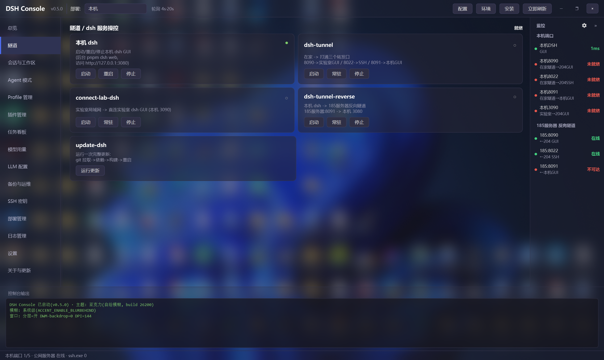
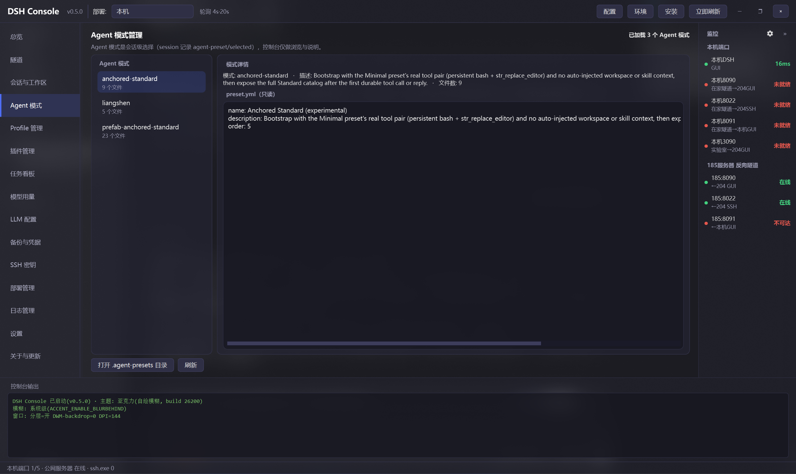
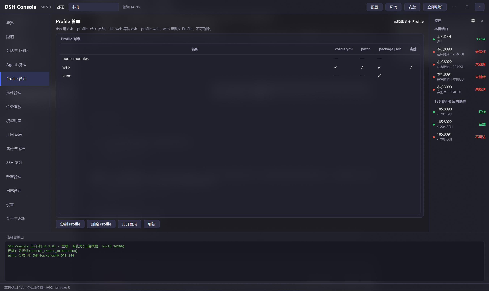
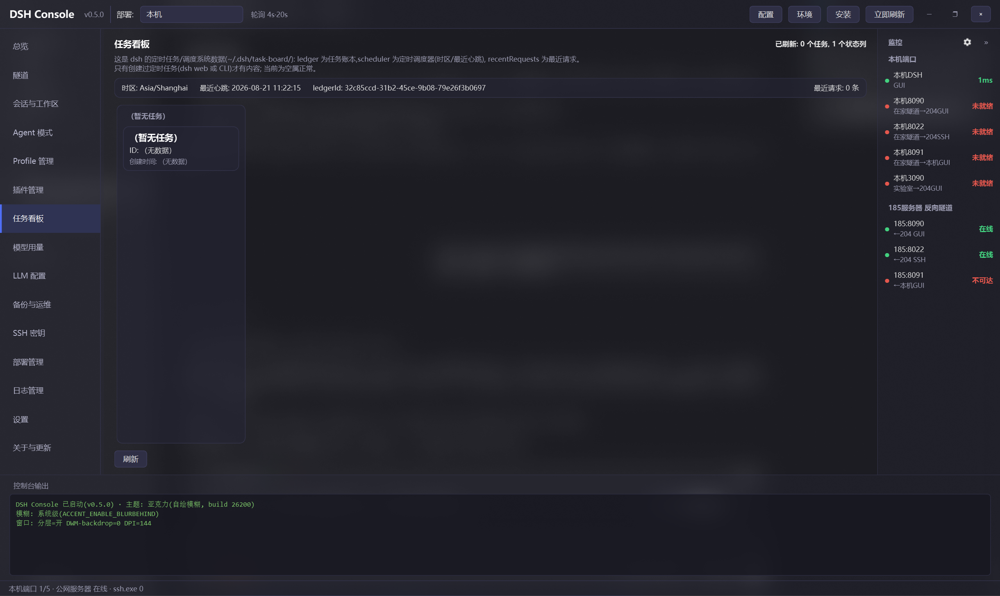
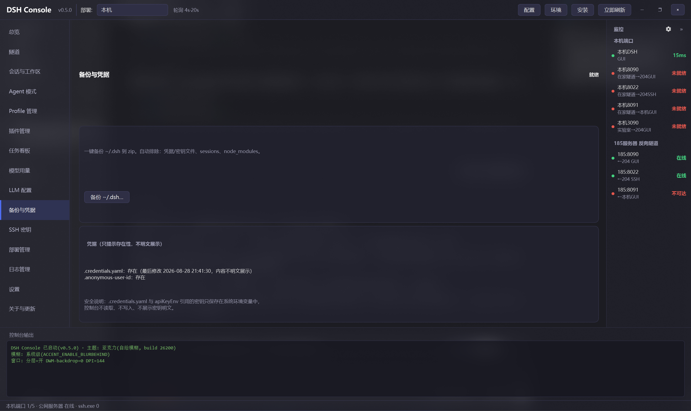
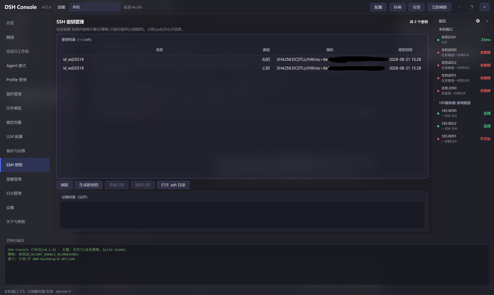
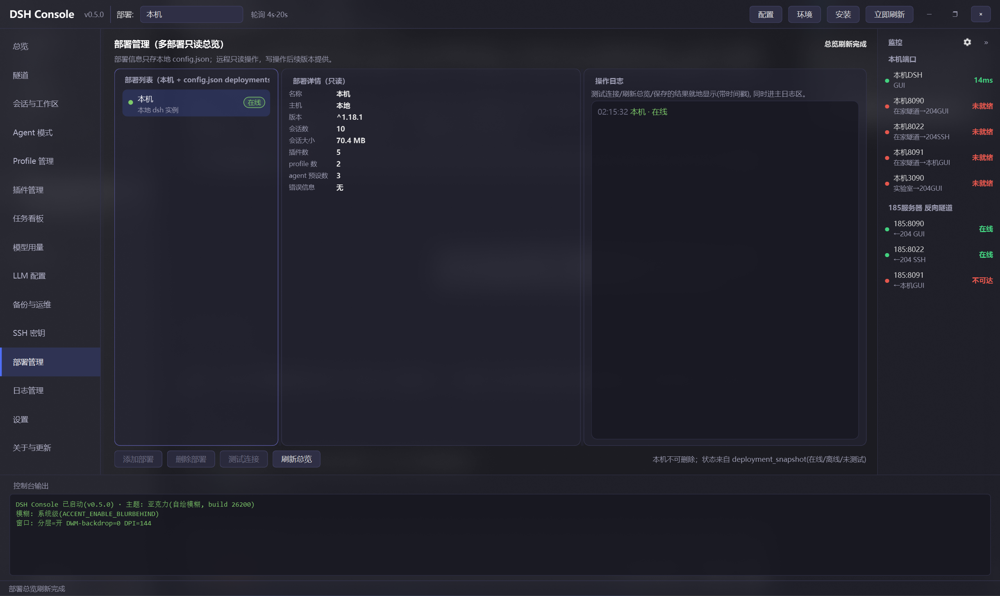
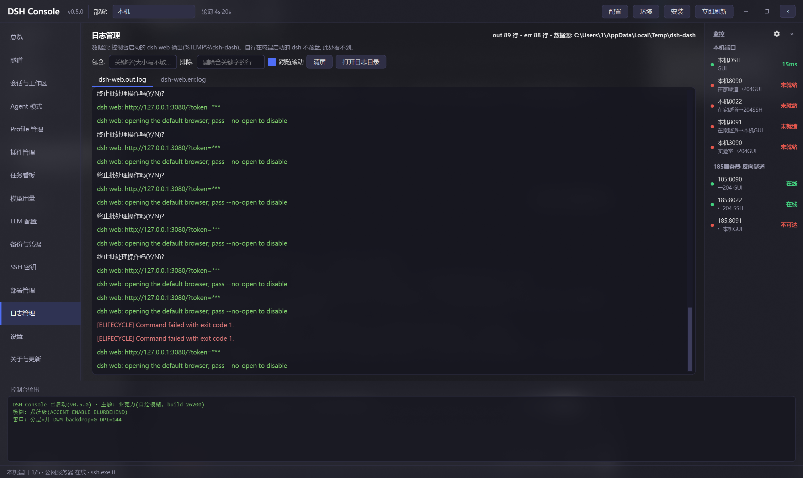

# dsh-console-aio

> 中文 | [English](#english)

**dsh All-In-One 控制台**（Windows GUI，PySide6 亚克力界面，支持深/浅主题）：SSH 隧道管理、本机 dsh 启停/安装/更新、健康监控，以及 15 个页面的 dsh 数据域管理（会话/Agent/Profile/插件/任务/用量/LLM/部署/日志/设置…）。

- 🚀 一键操作：本机 dsh 启停、SSH 隧道（启动/常驻/停止）、dsh 一键更新、全新环境一键安装
- 🖥️ 环境检查：git/node/npm/pnpm 版本与推荐基准，更新/安装/卸载引导
- 📡 健康监控：本机端口 + SSH 直查远端反向隧道，右栏一屏可见（可收起）
- 🗂️ 数据域管理：会话与工作区、Agent 模式、Profile、插件、任务看板、模型用量、LLM 配置、部署管理
- 🪵 日志管理：dsh web 输出实时 tail + 过滤 + 着色
- ⚙️ 设置页：全部配置标签页化，保存即热重载（弹窗收敛：极少模态框）
- 现代界面：PySide6 深色亚克力 + 现代列表/卡片组件 + 线程安全 + 一键打包分发

---

## 快速开始

### 方式一：安装包（推荐）
下载 **dsh-console-aio-setup-0.6.0.exe**（[GitHub Releases](https://github.com/JimyuAn-98/dsh-console-aio/releases)），双击安装即可使用（无需 Python 环境）。
安装后可创建桌面快捷方式；卸载走系统控制面板。

### 方式二：双击（源码）
双击 **启动dsh控制台.bat** —— 它优先使用 conda base 的 pythonw 启动，找不到再回退 PATH。
源码方式需已安装 PySide6（`pip install PySide6`）；打包版无需任何 Python 环境。

### 方式三：命令行
    python dsh-console-aio.py

> 💡 需要本机安装 Python 3（建议 Miniconda base，路径可改 启动dsh控制台.bat 顶部的 PYW）。

---

## 界面布局

    顶部:  [🐳 DSH Console v0.6 ]   部署:[本机 ▾]        [搜索][立即刷新]
    左导航            │ 中栏: 页面容器(17 页)                │ 右栏: 监控(可收起)
    总览               │ 总览: 运行状态+数据速览+部署+隧道      │ 本机端口 ●●●●●
    隧道               │ 插件: 列表|详情|配置 (三栏可拖拽)      │ 公网中转 反向隧道 ●●●
    会话与工作区       │ ...                                 │
    ...               │                                     │
    日志管理 / 设置    │                                     │
    ──────────────────┼──────────────────────────────────────┼─────────
    底部: 控制台输出(日志实时滚动) / 全局状态栏

  * ●=绿:健康/运行   ●=红:异常   * 切换顶部部署选择器 = 切换管理目标(远程只读)

---

## 一键安装 dsh（全新环境）

在 **DSH 管理** 页的「安装 dsh」卡填写 dsh 的 git 仓库地址（默认官方 deepseek-harness）与目标目录（可浏览选择，留空默认用户主目录/dsh），点「开始安装」即在页面内分步（step in place）执行：

1. **环境预检**：检查 git / node / npm / pnpm 是否可用，缺失会明确提示先装什么
2. **git clone**：拉取 dsh 源码到目标目录
3. **pnpm install**：安装依赖
4. **pnpm run build**：构建
5. 完成后**自动把目标目录写进 config.json 的 dash_repo**（重启后生效）

进度条 + 流式日志显示在页内安装卡，安装过程中实时可见每步输出。适合在没有 dsh 的新机器 / 新用户上，从零一键搭好本机 dsh。

同页的「开发环境检查」卡内联展示 git / node / npm / pnpm 的版本与推荐基准，点「更新/安装/卸载」会先说明将执行什么，确认后才执行（环境检查/安装向导已退役模态弹窗，改为页面内分步）。

## 卸载 dsh

**DSH 管理** 页「卸载 dsh」卡提供两种模式，均先停 web、再删源码目录并清空 config：

- **保留数据卸载**：只删源码（`dash_repo`）并清空 `config.json` 的 dash_repo；`~/.dsh` 数据（对话/会话/工作区/配置）保留
- **彻底卸载（含数据）**：额外删除 `~/.dsh` 数据目录——会清掉所有对话记录，**二次确认**后才执行

执行前会逐条列出将删除的具体路径；源码/数据目录删除有防误删守卫（绝不删用户主目录）。

---

## 设置（config.json）

所有可调项集中在 config.json；也可点顶栏 **【配置】** 进入「设置」页（标签页：隧道与部署 / 监控与命名），
**保存后端口/命名/监控点即时热重载**，无需重启。隧道 SSH 参数在下次启动隧道时生效。

- 场景模板一键填充（在家→中继隧道 / 实验室直连 / 本机反向）
- 测试 SSH 连接 在线验证免密连通
- 三处机器命名（本机/实验室/公网中转）与监测端口增删改，界面全部跟随

仓库自带一份 config.example.json（不含真实 IP 的模板）。首次使用请：

    copy config.example.json config.json   # 然后编辑其中的 IP/仓库路径/端口

若没有 config.json，程序会使用内置默认值正常运行。

| 字段 | 说明 | 默认 |
|------|------|------|
| ssh_server | 公网中转服务器 IP/域名 | YOUR_PUBLIC_IP |
| ssh_user | 中转服务器隧道用户名 | YOUR_USER |
| dash_repo | 本机 dsh 仓库路径 | <留空, 设置页里填> |
| dash_port | 本机 dsh GUI 端口 | 3080 |
| dash_cmd | 本机 dsh 启动命令 | ["pnpm.cmd","dsh","web"] |
| local_ports | 本机端口监控 [端口,名称,说明] | 3080/8090/8022/8091/3090 |
| remote_tunnels | 远端反向隧道监控 [端口,名称,说明] | 8090/8022/8091 |
| local_name / lab_name / ssh_name | 三处机器命名（界面跟随） | 本机/实验室/公网中转 |
| poll_seconds / remote_poll_seconds | 本机轮询 / SSH 直查间隔(秒) | 4 / 20 |
| *_timeout | 探测与更新超时 | ... |

> 真实 IP / 用户名 / 仓库路径只保存在本地 config.json（已 gitignore），请勿把它们写进 README 或任何被提交的文件。

---

## 工作原理

典型拓扑（多机 + 公网中转）：

    [实验室dsh 服务器(实验室)]          [Windows 本机]
      dsh GUI :3090               dsh GUI :3080
        |  反向隧道(常驻)               |  反向隧道(常驻)
        +-------------> 公网服务器 公网中转 <-------------+
                        8090->实验室dshGUI   8091->本机GUI
                        8022->实验室dshSSH
                            |
             在家/外部: 正向隧道访问

- 反向隧道在 公网服务器 上监听回环端口，默认仅绑定 127.0.0.1（安全）。
- 本机端口行反映本机监听状态；公网中转 反向隧道行通过 SSH 直查中转上的监听状态，才是"隧道是否配置成功"的真实指标。

### 隧道引擎
| 模块 | 作用 | 状态 |
|------|------|------|
| core/tunnel_mgr.py | 纯 Python 隧道管理器（forward/reverse, start/persist/stop） | ✅ |
| dsh-tunnel 卡片 | 在家正向隧道三连（8090/8022/8091） | ✅ 纯 Python |
| connect-lab-dsh 卡片 | 实验室局域网直连 实验室dsh（本机 3090） | ✅ 纯 Python |
| dsh-tunnel-reverse 卡片 | 本机 dsh -> 公网服务器 反向隧道（公网服务器:8091 -> 3080） | ✅ 纯 Python |
| update-dsh 卡片 | git 拉取 + pnpm 构建 + 重启（流式日志） | ✅ 纯 Python |

> 旧的 4 个 .ps1 已收进 legacy/ 目录，仅供历史参考，不再被界面调用。
> 连接参数（服务器 IP/用户名/端口）全部来自 config.json，无硬编码。

---

## 安全说明
- 中转服务器端口默认只绑回环，公网不可直达——除非你明确配置 GatewayPorts 并承担无鉴权 GUI 暴露公网的风险（=远程代码执行入口），否则请勿这样做。
- SSH 隧道需先配置好到中转/目标服务器的免密登录。
- 控制台不读取/不展示任何密钥明文；凭据只提示存在性。

---

## 数据域管理（17 页导航）

| 页面 | 功能 |
|------|------|
| 总览 | 运行状态卡 + 数据速览（会话/用量/任务板/插件）+ 部署列表 + 隧道速览 |
| DSH 管理 | 本机 dsh 操控（启动/重启/停止）+ 完整更新 + 环境/安装 + 版本信息（GitHub tags 对比） |
| 隧道 | 隧道卡片启停/常驻 + 本机 dsh 启停/更新 |
| 会话与工作区 | 分组/会话/详情三栏，归档/恢复/删除（二次确认） |
| Agent 模式 | 窄列表按名字选 + preset.yml 只读详情 |
| Profile 管理 | 列出 / 复制 / 删除 profile |
| 插件管理 | 列表/详情/cordis 合成配置三栏；官方 `dsh plugin` 命令安装/卸载；patch 层停用/启用（配置态与生效态徽章） |
| 任务看板 | ledger + scheduler 只读展示 |
| 模型用量 | 解压 session 聚合 token（按模型/天）+ 价格估算 + 明细卡 |
| LLM 配置 | 默认模型切换、自定义 provider 浏览（密钥只提示环境变量名） |
| 备份与凭据 | ~/.dsh 一键备份（排除凭据）、凭据存在性提示 |
| SSH 密钥 | 生成/指纹/公钥查看（私钥内容绝不读取） |
| 部署管理 | 多部署列表/详情/操作日志三栏：CRUD、连接测试、只读快照（在线徽章） |
| 日志管理 | dsh web 落盘输出 tail + 过滤 + 着色 + token 脱敏 |
| 设置 | 配置标签页化，保存即热重载；诊断报告（脱敏可外发）与配置导入导出 |
| 主题 | 明/暗变体一键切换 + 全部界面颜色实时可调（即时预览），可存/载主题文件、设启动默认 |
| 关于与更新 | 当前版本 / 检查更新 / 更新日志 / 一键自动更新 |

---

## Roadmap（dsh 控制台进化路线）
- [x] 配置外置到 config.json（IP/用户/端口/轮询）+ 配置热重载（保存即生效）
- [x] 全部卡片 Python 化（core/tunnel_mgr.py + 纯 Python 更新）；旧 .ps1 收进 legacy/
- [x] **PySide6 现代界面**：深色亚克力 + 现代列表/卡片组件 + 17 页导航（含实时主题定制）
- [x] **明/暗主题**：浅色整套变体 + 主题页一键切换（深色为默认, config 持久化）
- [x] 一键安装 dsh + 环境检查（更新/安装/卸载引导；弹窗收敛：改 DSH 管理页页面内分步）
- [x] 卸载 dsh（保留数据 / 彻底卸载含 ~/.dsh, 危险操作双确认 + 防误删守卫）
- [x] 打包分发（PyInstaller + Inno Setup，GitHub Actions 自动发版）
- [x] **会话与工作区管理**：分组浏览 / 归档 / 恢复 / 删除（二次确认）
- [x] **Agent 模式管理**：窄列表 + preset.yml 详情
- [x] **Profile 管理**：列出 / 复制 / 删除
- [x] **dsh 插件管理**：列表 / 安装 / 卸载 / patch 层启停（配置态+生效态徽章）
- [x] **任务看板**：ledger + scheduler 只读展示
- [x] **模型用量统计**：token 聚合（按模型/天）+ 价格估算 + 明细
- [x] **LLM 配置**：默认模型切换 + provider 浏览
- [x] **备份与凭据**：~/.dsh 一键备份 / 凭据提示
- [x] **部署管理**：多部署只读总览 + 操作日志
- [x] **日志管理**：dsh web 输出 tail / 过滤 / 着色
- [x] **设置页**：配置标签页化 + 热重载（弹窗收敛第一步）
- [x] **版本管理**：当前版本 / 检查更新 / 更新日志 / 一键自动更新
- [ ] 多套拓扑配置切换
- [x] 明/暗主题切换（主题页, 浅色整套变体, 深色为默认）
- [ ] 多主题预设切换（Mica 深色/纯色）+ 布局记忆
- [x] 配置导出导入 + 诊断报告一键生成（设置页「诊断与配置」标签）
- [x] 用量趋势图表（按模型堆叠, 设置在用量页）
- [x] 全局命令面板 Ctrl+K（页面/部署/动作 搜索直达）
- [ ] 小白引导：首次使用向导 / 诊断助手 / 常见问题

## License
MIT © 2025 JimyuAn

---

# dsh-console-aio (English)

**dsh All-In-One console** (Windows GUI, PySide6 acrylic, dark/light themes): SSH tunnel management, local dsh start/stop/install/update, health monitoring, and a 17-page dsh data-domain console (sessions/agents/profiles/plugins/tasks/usage/LLM/deployments/logs/settings).

## Features
- One-click control: local dsh GUI start/stop, SSH tunnels (start/persist/stop), one-click dsh update
- **One-click dsh install**: repo URL + target dir → env pre-check → clone → pnpm install → build → auto-write config
- **Environment check**: git/node/npm/pnpm versions vs. recommended baseline, with update / install / uninstall actions
- Two-layer health monitor: local ports + reverse tunnels queried via SSH (collapsible right panel)
- Data-domain console: sessions, agents, profiles, plugins, task board, model usage, LLM config, deployments
- **Log viewer**: live tail of dsh web output with filtering, coloring and token masking
- **Settings page**: all config as tabs, hot-reload on save (dialog-free by design)
- Modern PySide6 UI: dark acrylic, modern list/card components, thread-safe

## Quick Start
- Download **dsh-console-aio-setup-0.6.0.exe** from [Releases](https://github.com/JimyuAn-98/dsh-console-aio/releases) (no Python needed), or run from source:
      python dsh-console-aio.py   (requires Python 3 + `pip install PySide6`)

## One-click dsh install
On the **DSH Manage** page, the "Install dsh" card takes a git repo URL (default: official deepseek-harness) and target directory (browse or leave blank for `~/dsh`). Click **Start Install** to run the steps **in-page** (step in place) with a progress bar and streaming log:
1. Pre-check environment (git / node / npm / pnpm)
2. git clone → 3. pnpm install → 4. pnpm run build
5. Auto-write the target dir into config.json's dash_repo

## Environment check
On the **DSH Manage** page, the "Development environment check" card shows git / node / npm / pnpm versions vs. a recommended baseline, each with Update / Install / Uninstall actions (confirm-before-run). The env check and install wizard are step-in-place cards on the page (the modal EnvDialog / InstallDialog windows are retired).

## Uninstall dsh
On the **DSH Manage** page, the "Uninstall dsh" card stops the running web, deletes the source directory (`dash_repo`) and clears `config.json`'s dash_repo, with two modes:
- **Keep data**: removes the source only; `~/.dsh` (conversations/sessions/workspaces/config) is kept
- **Full uninstall (with data)**: additionally deletes `~/.dsh` — irreversible, requires a double confirmation

The exact paths to be deleted are listed before running; delete guards never touch the user home directory.

## Configuration
All tunables live in config.json; the **Config** button opens the Settings page (tabs: tunnels & deployments / monitoring & naming). **Saving hot-reloads** ports, naming and monitor probes — no restart needed.

See the Chinese section above for the full field table.

## Data-domain pages (17-page navigation)
| Page | What it does |
|--------|-------------|
| Overview | run-status card + data quick-look (sessions/usage/tasks/plugins) + deployments + tunnels |
| DSH manage | local dsh start/restart/stop + full update + env/install + version info (GitHub tags diff) |
| Tunnels | tunnel card start/persist/stop + local dsh start/stop/update |
| Sessions & workspace | group/session/detail columns, archive/restore/delete (double confirm) |
| Agent presets | narrow name list + read-only preset.yml detail |
| Profiles | list / copy / delete profiles |
| Plugins | list/detail/composed-config columns; official `dsh plugin` install/uninstall; patch-layer enable/disable (config vs. effective badges) |
| Task board | ledger + scheduler read-only |
| Model usage | decompress sessions, aggregate tokens (by model/day) + cost estimate + daily trend chart |
| LLM config | switch default model, browse custom providers (API keys only hinted by env-var name) |
| Backup & credentials | one-click ~/.dsh backup (credentials excluded), credential presence hints |
| SSH keys | generate / fingerprints / public-key view (private keys are never read) |
| Deployments | multi-deployment list/detail/op-log columns: CRUD, connection test, read-only snapshots |
| Logs | live tail of dsh web output with filtering, coloring, token masking |
| Settings | config as tabs, hot-reload on save; masked diagnostics report & config import/export |
| Theme | toggle dark/light variant + edit every UI color live (instant preview), save/load theme files, set startup default |
| About & update | current version / check update / changelog / one-click auto-update |

## Auto release (GitHub Actions)
Pushing a `v*` tag triggers the CI workflow: PyInstaller onefile → Inno Setup installer (`dsh-console-aio-setup-<version>.exe`) → attach to a GitHub Release.

    git tag v0.6.0
    git push origin v0.6.0

(Update `APP_VERSION` in code, `version.json`, the `installer.iss` default version and RELEASE_NOTES before tagging.)

## Security
- Relay ports bind loopback only by default; do not expose the unauthenticated GUI to public internet (remote-code-execution risk) unless you explicitly accept it.
- The console never reads or displays secret material; credentials are only hinted by presence.

## Roadmap
- [x] External config + hot-reload
- [x] PySide6 modern UI (dark acrylic + modern list/card components + 17-page navigation)
- [x] One-click dsh install + environment check
- [x] Packaged distribution (PyInstaller + Inno Setup, GitHub Actions auto-release)
- [x] Plugin manager (list / install / uninstall / patch-layer toggles with config & effective badges)
- [x] Log viewer (tail / filter / colorize)
- [x] Settings page (config as tabs + hot-reload)
- [x] Overview redesign (run status + data quick-look + deployments + tunnels)
- [ ] Multiple topology profiles
- [ ] Theme switching (Mica/solid/light) + layout memory
- [ ] Command palette (Ctrl+K) / config export-import / diagnostics report / usage charts
- [ ] Beginner onboarding (first-run wizard / diagnostics / FAQ)

## License
MIT © 2025 JimyuAn
